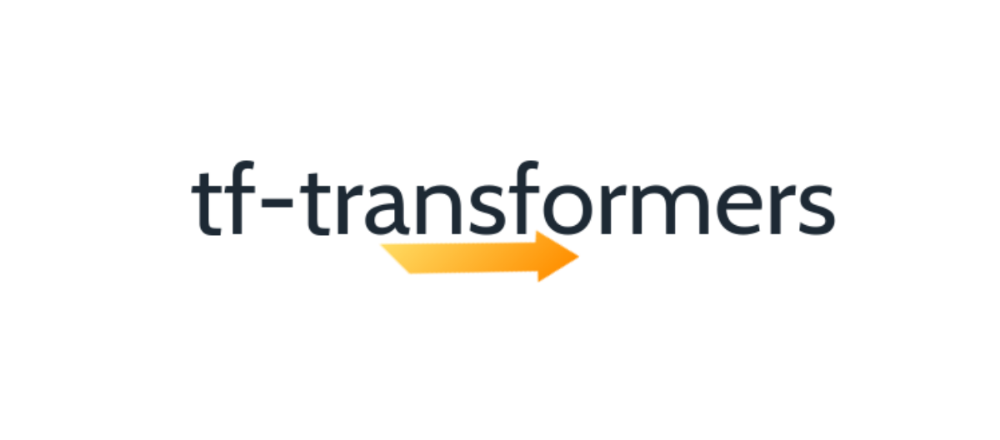
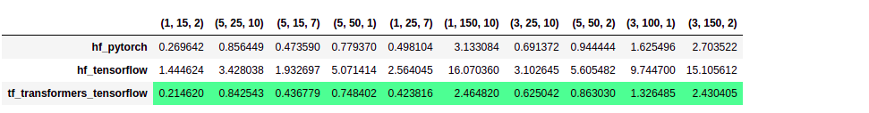
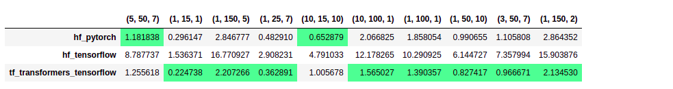
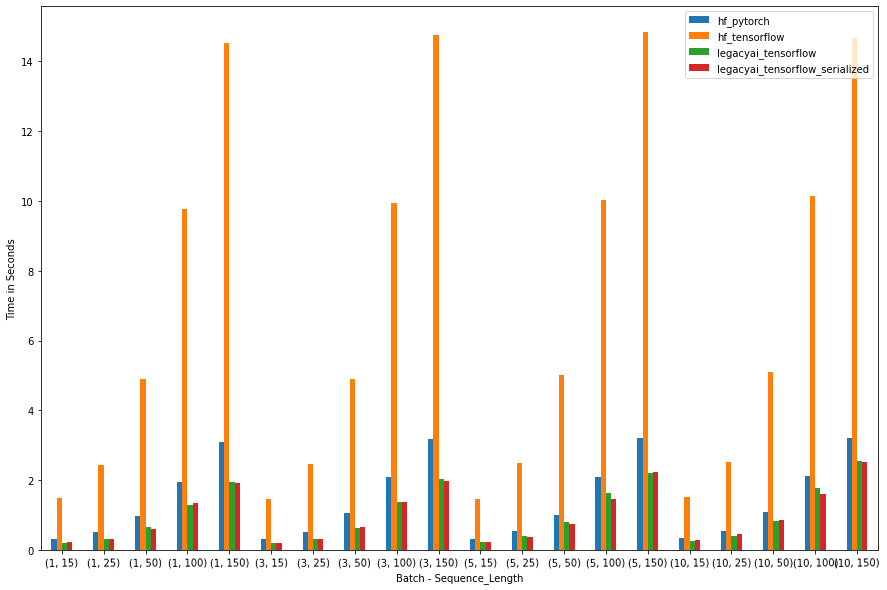
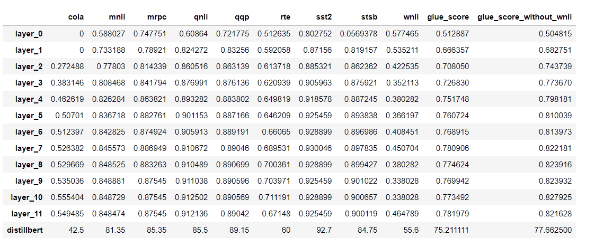
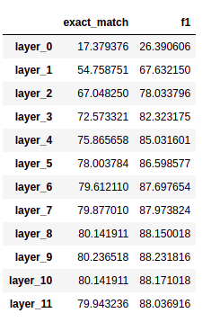

<!---
Copyright 2021 The LegacyAI Team. All rights reserved.

Licensed under the Apache License, Version 2.0 (the "License");
you may not use this file except in compliance with the License.
You may obtain a copy of the License at

    http://www.apache.org/licenses/LICENSE-2.0

Unless required by applicable law or agreed to in writing, software
distributed under the License is distributed on an "AS IS" BASIS,
WITHOUT WARRANTIES OR CONDITIONS OF ANY KIND, either express or implied.
See the License for the specific language governing permissions and
limitations under the License.
-->

<p align="center">
    <br>
    
    <br>
<p>

<h3 align="center">
<p>tf-transformers: faster and easier state-of-the-art NLP in TensorFlow 2.0
</h3>

tf-transformers is designed to harness the full power of Tensorflow 2, to make it much faster and simpler comparing to existing Tensorflow based NLP architectures. On an average, there is **80 %** improvement over current exsting Tensorflow based libraries, on text generation and other tasks. You can find more details in the Benchmarks section.

All / Most NLP downstream tasks can be integrated into Tranformer based models with much ease. All the models can be trained using ```model.fit```, which supports **GPU**, **multi-GPU**, **TPU**.

## Unique Features
- **Faster AutoReggressive Decoding** using Tensorflow2. Faster than PyTorch in most experiments (V100 GPU). **80%** faster compared to existing TF based libararies (relative difference) Refer [benchmark code](tests/notebooks/benchmarks/).
- Complete **TFlite** support for **BERT, RoBERTA, T5, Albert, mt5** for all down stream tasks except text-generation
- **Faster sentence-piece alignment** (no more LCS overhead)
- **Variable batch text generation** for Encoder only models like GPT2
- No more hassle of writing long codes for **TFRecords. minimal and simple**.
- Off the shelf support for auto-batching **tf.data.dataset** or **tf.ragged** tensors
- Pass dictionary outputs directly to loss functions inside ```tf.keras.Model.fit``` using **model.compile2** . Refer [examples]() or [blog]()
- Multiple mask modes like **causal**, **user-defined**, **prefix** by changing one argument . Refer [examples]() or [blog]()


## Performance Benchmarks

Evaluating performance benhcmarks is trickier. I evaluated **tf-transformers**, primarily on **text-generation** tasks with **GPT2 small** and **t5 small**, with amazing **HuggingFace**, as it is the ready to go library for NLP right now. Text generation tasks require efficient caching to make use of past **Key** and **Value** pairs.

On an average, **tf-transformers** is **80 %** faster than **HuggingFace** **Tensorflow** implementation and in most cases it is **comparable** or **faster** than **PyTorch**.

#### 1. GPT2 benchmark

The evaluation is based on average of 5 runs, with different **batch_size**, **beams**, **sequence_length** etc. So, there is qute a larg combination, when it comes to **BEAM** and **top-k*8 decoding. The figures are **randomly taken 10 samples**. But, you can see the full code and figures in the repo.

* GPT2 greedy

<p align="left">
    <br>
    
    <br>
<p>

* GPT2 beam

<p align="left">
    <br>
    
    <br>
<p>

* GPT2 top-k top-p

<p align="left">
    <br>
    
    <br>
<p>

* GPT2 greedy histogram

<p align="left">
    <br>
    
    <br>
<p>

[Codes to reproduce GPT2 benchmark experiments](../tests/notebooks/benchmarks/gpt2)

[Codes to reproduce T5 benchmark experiments](../tests/notebooks/benchmarks/t5)

## Production Ready Tutorials


Here are a few examples:
- [Basics of tf-transformers](Coming Soon)
- [Convert HuggingFace Models ( BERT, Albert, Roberta, GPT2, t5, mt5) to tf-transformers checkpoints](src/tf_transformers/notebooks/conversion_scripts/)
- [Name Entity Recognition + Albert + TFlite + Joint Loss](src/tf_transformers/notebooks/tutorials/ner_albert.ipynb)
- [Squad v1.1 + Roberta + TFlite](src/tf_transformers/notebooks/tutorials/squad_roberta.ipynb)
- [Roberta2Roberta Encoder Decoder + XSUM + Summarisation](src/tf_transformers/notebooks/tutorials/seq2seq_summarization.ipynb)
- [Squad v1.1 + T5 + Text Generation](src/tf_transformers/notebooks/tutorials/t5_squad_as_generation.ipynb)
- [Squad v1.1 + T5 + Span Selection](src/tf_transformers/notebooks/tutorials/t5_squad_span_selection.ipynb)
- [Albert + GLUE + Joint Loss - Glue Score 81.0 on 14 M parameter + 5 layers](src/tf_transformers/notebooks/tutorials/joint_loss_experiments)
- [Albert + Squad + Joint Loss - EM/F1 78.1/87.0 on 14 M parameter + 5 layers](src/tf_transformers/notebooks/tutorials/joint_loss_experiments/squad.ioynb)
- [Squad v1.1 + GPT2 + Causal Masking EM/F1 37.36/50.20] (Coming Soon)
- [Squad v1.1 + GPT2 + Prefix Masking EM/F1 47.52/63.20](Coming Soon)

## Why should I use tf-transformers?

1. Use state-of-the-art models in Production, with less than 10 lines of code.
    - High performance models, better than all official Tensorflow based models
    - Very simple classes for all downstream tasks
    - Complete TFlite support for all tasks except text-generation

2. Make industry based experience to avaliable to students and community with clear tutorials

3. Train any model on **GPU**, **multi-GPU**, **TPU** with amazing ```tf.keras.Model.fit```
    - Train state-of-the-art models in few lines of code.
    - All models are completely serializable.


4. Customize any models or pipelines with minimal or no code change.

## Do we really need to distill? Jont Loss is all we need.

#### 1. GLUE
We have conducted few experiments to squeeze the power of **Albert base** models ( concept is applicable to any models and in tf-transformers, it is out of the box.)

The idea is minimize the loss for specified task in each layer of your model and check predictions at each layer. as per our experiments, we are able to get the best smaller model (thanks to **Albert**), and from **layer 4** onwards we beat all the smaller model in **GLUE** benchmark. By **layer 6**, we got a **GLUE** score of **81.0**, which is **4** points ahead of **Distillbert** with GLUE score of **77** and **MobileBert** GLUE score of **78**.

The **Albert** model has **14 million** parameters, and by using **layer 6**, we were able to speed up the compuation by 50% .

The concept is applicable to all the models.

[Codes to reproduce GLUE Joint Loss experiments](src/tf_transformers/notebooks/tutorials/joint_loss_experiments/glue/)


<p align="left">
    <br>
    Benchmark Results
    
    <br>
<p>

* GLUE score ( not including WNLI )

#### 2. SQUAD v1.1

We have trained Squad v1.1 with joint loss. At **layer 6** we were able to achieve same performance as of **Distillbert** - (**EM - 78.1 and F1 - 86.2**), but slightly worser than **MobileBert**.

Benchmark Results
<p align="left">
    <br>
    
    <br>
<p>

[Codes to reproduce Squad v1.1 Joint Loss experiments](src/tf_transformers/notebooks/tutorials/joint_loss_experiments/squad.ipynb
)

**Note**: We have a new model in pipeline. :-)
## Installation

### With pip

This repository is tested on Python 3.7+, and Tensorflow 2.4.0

Recommended to use a [virtual environment](https://docs.python.org/3/library/venv.html).

Assuming Tensorflow 2.0 is installed

```bash
pip install tf-transformers
```


## Supported Models architectures


tf-transformers currently provides the following architectures .
1. **[ALBERT](https://huggingface.co/transformers/model_doc/albert.html)** (from Google Research and the Toyota Technological Institute at Chicago) released with the paper [ALBERT: A Lite BERT for Self-supervised Learning of Language Representations](https://arxiv.org/abs/1909.11942), by Zhenzhong Lan, Mingda Chen, Sebastian Goodman, Kevin Gimpel, Piyush Sharma, Radu Soricut.
2. **[BERT](https://huggingface.co/transformers/model_doc/bert.html)** (from Google) released with the paper [BERT: Pre-training of Deep Bidirectional Transformers for Language Understanding](https://arxiv.org/abs/1810.04805) by Jacob Devlin, Ming-Wei Chang, Kenton Lee and Kristina Toutanova.
3. **[BERT For Sequence Generation](https://huggingface.co/transformers/model_doc/bertgeneration.html)** (from Google) released with the paper [Leveraging Pre-trained Checkpoints for Sequence Generation Tasks](https://arxiv.org/abs/1907.12461) by Sascha Rothe, Shashi Narayan, Aliaksei Severyn.
4. **[ELECTRA](https://huggingface.co/transformers/model_doc/electra.html)** (from Google Research/Stanford University) released with the paper [ELECTRA: Pre-training text encoders as discriminators rather than generators](https://arxiv.org/abs/2003.10555) by Kevin Clark, Minh-Thang Luong, Quoc V. Le, Christopher D. Manning.
5. **[GPT-2](https://huggingface.co/transformers/model_doc/gpt2.html)** (from OpenAI) released with the paper [Language Models are Unsupervised Multitask Learners](https://blog.openai.com/better-language-models/) by Alec Radford*, Jeffrey Wu*, Rewon Child, David Luan, Dario Amodei** and Ilya Sutskever**.
6. **[MT5](https://huggingface.co/transformers/model_doc/mt5.html)** (from Google AI) released with the paper [mT5: A massively multilingual pre-trained text-to-text transformer](https://arxiv.org/abs/2010.11934) by Linting Xue, Noah Constant, Adam Roberts, Mihir Kale, Rami Al-Rfou, Aditya Siddhant, Aditya Barua, Colin Raffel.
7. **[RoBERTa](https://huggingface.co/transformers/model_doc/roberta.html)** (from Facebook), released together with the paper a [Robustly Optimized BERT Pretraining Approach](https://arxiv.org/abs/1907.11692) by Yinhan Liu, Myle Ott, Naman Goyal, Jingfei Du, Mandar Joshi, Danqi Chen, Omer Levy, Mike Lewis, Luke Zettlemoyer, Veselin Stoyanov.
ultilingual BERT into [DistilmBERT](https://github.com/huggingface/transformers/tree/master/examples/distillation) and a German version of DistilBERT.
**[T5](https://huggingface.co/transformers/model_doc/t5.html)** (from Google AI) released with the paper [Exploring the Limits of Transfer Learning with a Unified Text-to-Text Transformer](https://arxiv.org/abs/1910.10683) by Colin Raffel and Noam Shazeer and Adam Roberts and Katherine Lee and Sharan Narang and Michael Matena and Yanqi Zhou and Wei Li and Peter J. Liu.


## Credits

I want to give credits to [Tensorflow NLP official repository](https://github.com/tensorflow/models/tree/master/official/nlp). I used November 2020 version of master branch ( where ```tf.keras.Network```) was used for models. I have modified that by large extend now.

Apart from that, I have used many common scripts from many open repos. I might not be able to recall everything as it is. But still credit goes to them  too.

## Citation

:-)
