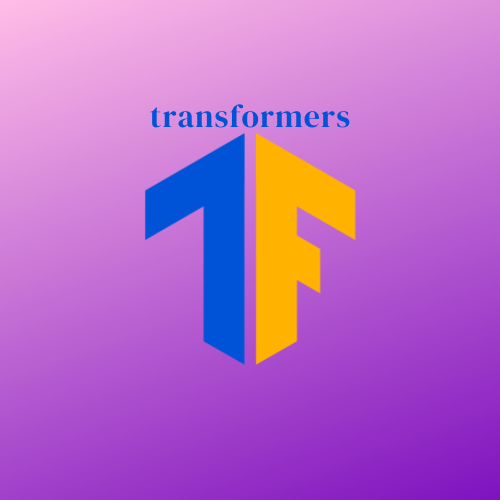

<!---
Copyright 2021 The LegacyAI Team. All rights reserved.

Licensed under the Apache License, Version 2.0 (the "License");
you may not use this file except in compliance with the License.
You may obtain a copy of the License at

    http://www.apache.org/licenses/LICENSE-2.0

Unless required by applicable law or agreed to in writing, software
distributed under the License is distributed on an "AS IS" BASIS,
WITHOUT WARRANTIES OR CONDITIONS OF ANY KIND, either express or implied.
See the License for the specific language governing permissions and
limitations under the License.
-->

<p align="center">
    <br>
    
    <br>
</p>

<p align="center">
<a href="https://github.com/legacyai/tf-transformers/actions?workflow=Tests">
        
</a>

<a href="https://codecov.io/gh/legacyai/tf-transformers">
        
</a>

<a href="https://opensource.org/licenses/Apache-2.0">
        
</a>
</p>

<h1 align="center">
<b>Tensorflow Transformers</b>
</h1>

<h5 align="center">
<p>Website: https://legacyai.github.io/tf-transformers</p>
</h5>

<h3 align="center">
<p>tf-transformers: faster and easier state-of-the-art Transformer in TensorFlow 2.0
</h3>

Imagine auto-regressive generation to be **90x** faster.
tf-transformers (Tensorflow Transformers) is designed to harness the full power of Tensorflow 2, designed specifically for Transformer based architecture.

These models can be applied on:

* 📝 Text, for tasks like text classification, information extraction, question answering, summarization, translation, text generation, in over 100 languages.
* 🖼️ Images, for tasks like image classification, object detection, and segmentation.
* 🗣️ Audio, for tasks like speech recognition and audio classification. (Coming Soon)
## Version
version: v1.0.8
## Unique Features
- **Faster AutoReggressive Decoding**
- **TFlite** support
- **Creating TFRecords is simple**.
- **Auto-Batching tf.data.dataset** or **tf.ragged** tensors
- **Everything is dictionary (inputs and outputs)**
- Multiple mask modes like **causal**, **user-defined**, **prefix**.
- **tensorflow-text tokenizer** support
- **Supports GPU, TPU, multi-GPU trainer with wandb, multiple callbacks, auto tensorboard**


## Benchmark on GPT2 text generation

GPT2 text generation with ```max_length=64```, ```num_beams=3``` .

```
tf_transformers : 31 minutes
huggingface_tf  : 83 minutes
huggingface_pt  : 36 minutes
huggingface_jax : 35 minutes
```

From ```83 minutes``` to ```31 minutes``` is a significant speedup. ```167 %1``` speedup.
On an average, **tf-transformers** is **80-90 times** faster than **HuggingFace** **Tensorflow** implementation and in most cases it is **comparable** or **faster** than **PyTorch**.

More benchmarks can be found in [benchmark](https://github.com/legacyai/tf-transformers/tree/main/benchmarks)

## Installation
### With pip

This repository is tested on Python 3.7+ and TensorFlow 2.7.

#### Recommended prerequistes

```bash
pip install sentencepiece
pip install tensorflow-text >= 2.7.3
pip install tqdm
```
Install ```tensorflow >= 2.7.0 [CPU or GPU]``` as per your machine.
You should install tf-transformers in a [virtual environment](https://docs.python.org/3/library/venv.html). If you're unfamiliar with Python virtual environments, check out the [user guide](https://packaging.python.org/guides/installing-using-pip-and-virtual-environments/).

First, create a virtual environment with the version of Python you're going to use and activate it.

Then, you will need to install at least one of TensorFlow.
Please refer to [TensorFlow installation page](https://www.tensorflow.org/install/), installation pages regarding the specific install command for your platform. We highly recommend to install [tensorflow-text]
(https://www.tensorflow.org/text).

When one of those backends has been installed, tf-transformers can be installed using pip as follows:

```bash
pip install tf-transformers
```

### From source
```bash
git clone https://github.com/legacyai/tf-transformers.git
pip install poetry
cd tf-transformers
poetry install
```

## Quick tour

tf-transformers API is very simple and minimalistic.

```python
>>> from tf_transformers.models import GPT2Model
>>> model = GPT2Model.from_pretrained('gpt2')
>>> model.save_checkpoint("/tmp/gpt2_model/") # Save Model

```
For text-generation, it is very important to add :obj:`use_auto_regressive=True`. This is required for all the models.
```python

>>> from tf_transformers.models import GPT2Model
>>> model = GPT2Model.from_pretrained('gpt2', use_auto_regressive=True)
```
To serialize save and load model

```python
>>> from tf_transformers.models import GPT2Model
>>> model = GPT2Model.from_pretrained('gpt2')
>>> model.save_transformers_serialized("/tmp/gpt2_serialized/")

# To load a serialized models for inference in prodcution:

>>> import tensorflow as tf
>>> loaded = tf.saved_model.load("/tmp/gpt2_serialized/")
>>> model  = loaded.signatures['serving_default']
```
## Tutorials

We have covered tutorials covering pre-training, finetuning, classfication, QA, NER so much more.


- [Read and Write TFRecords using tft](https://github.com/legacyai/tf-transformers/blob/main/tutorials/1_read_write_tfrecords.ipynb)
- [Text Classification using Albert](https://github.com/legacyai/tf-transformers/blob/main/tutorials/2_text_classification_imdb_albert.ipynb)
- [Dynamic MLM (on the fly pre-processing using tf-text) in TPU](https://github.com/legacyai/tf-transformers/blob/main/tutorials/3_masked_lm_tpu.ipynb)
- [Image Classification ViT multi GPU mirrored](https://github.com/legacyai/tf-transformers/blob/main/tutorials/4_image_classification_vit_multi_gpu.ipynb)
- [Sentence Embedding train from scratch using Quoara on Roberta + Zeroshot STS-B](https://github.com/legacyai/tf-transformers/blob/main/tutorials/5_sentence_embedding_roberta_quora_zeroshot.ipynb)

## TFlite Tutorials
- [Albert TFlite](https://github.com/legacyai/tf-transformers/blob/main/docs/source/tflite_tutorials/albert_tflite.ipynb)
- [Bert TFlite](https://github.com/legacyai/tf-transformers/blob/main/docs/source/tflite_tutorials/bert_tflite.ipynb)
- [Roberta TFlite](https://github.com/legacyai/tf-transformers/blob/main/docs/source/tflite_tutorials/roberta_tflite.ipynb)

## Why should I use tf-transformers?

1. Use state-of-the-art models in Production, with less than 10 lines of code.
    - High performance models, better than all official Tensorflow based models
    - Very simple classes for all downstream tasks
    - Complete TFlite support for all tasks.

2. Make industry based experience to avaliable to students and community with clear tutorials

3. Train any model on **GPU**, **multi-GPU**, **TPU** with amazing ```tf.keras.Model.fit```
    - Train state-of-the-art models in few lines of code.
    - All models are completely serializable.

4. Customize any models or pipelines with minimal or no code change.

## Research

The [Research](https://github.com/legacyai/tf-transformers/tree/main/research) section has codes
for pre-training different models ranging from **MLM, T5, CLIP etc **. All these scripts are designed
to harness full power of tensorflow-io pipeline and tested on TPU V2 and TPU V3. Bugs are expected in
those, but it serves as a purpose for practioners to start or modifying what we have already done.

## Contributions

### **Joint Albert** *(Smallest and best Transformer based model ever) on GLUE*.
We have conducted few experiments to squeeze the power of **Albert base** models ( concept is applicable to any models and in tf-transformers, it is out of the box.)

The idea is minimize the loss for specified task in each layer of your model and check predictions at each layer. as per our experiments, we are able to get the best smaller model (thanks to **Albert**), and from **layer 4** onwards we beat all the smaller model in **GLUE** benchmark. By **layer 6**, we got a **GLUE** score of **81.0**, which is **4** points ahead of **Distillbert** with GLUE score of **77** and **MobileBert** GLUE score of **78**.

The **Albert** model has **14 million** parameters, and by using **layer 6**, we were able to speed up the compuation by 50% .

The concept is applicable to all the models and tasks.

[Codes + Read More](https://legacyai.github.io/tf-transformers/build/html/research/glue.html)

### **Long Block Sequence Transformer**
By splitting input sequence into block attention and merge using FFN layer we have shown that, smaller machines will be able to perform sequence processing up to 4096 tokens in a single V100 GPU machine.
The model has outperforms ```Pegasus Base (128 million)``` in ```PubMed``` summarisation despite being ```60 million``` parameter.

<p align="centre">
    <br>
    
    <br>
<p>

[Codes + Read More](https://legacyai.github.io/tf-transformers/build/html/research/long_block_sequencer.html)

## Supported Models architectures

tf-transformers currently provides the following architectures .
1. **[ALBERT](https://huggingface.co/transformers/model_doc/albert.html)** (from Google Research and the Toyota Technological Institute at Chicago) released with the paper [ALBERT: A Lite BERT for Self-supervised Learning of Language Representations](https://arxiv.org/abs/1909.11942), by Zhenzhong Lan, Mingda Chen, Sebastian Goodman, Kevin Gimpel, Piyush Sharma, Radu Soricut.
2. **[BERT](https://huggingface.co/transformers/model_doc/bert.html)** (from Google) released with the paper [BERT: Pre-training of Deep Bidirectional Transformers for Language Understanding](https://arxiv.org/abs/1810.04805) by Jacob Devlin, Ming-Wei Chang, Kenton Lee and Kristina Toutanova.
3. **[BERT For Sequence Generation](https://huggingface.co/transformers/model_doc/bertgeneration.html)** (from Google) released with the paper [Leveraging Pre-trained Checkpoints for Sequence Generation Tasks](https://arxiv.org/abs/1907.12461) by Sascha Rothe, Shashi Narayan, Aliaksei Severyn.
4. **[ELECTRA](https://huggingface.co/transformers/model_doc/electra.html)** (from Google Research/Stanford University) released with the paper [ELECTRA: Pre-training text encoders as discriminators rather than generators](https://arxiv.org/abs/2003.10555) by Kevin Clark, Minh-Thang Luong, Quoc V. Le, Christopher D. Manning.
5. **[GPT-2](https://huggingface.co/transformers/model_doc/gpt2.html)** (from OpenAI) released with the paper [Language Models are Unsupervised Multitask Learners](https://blog.openai.com/better-language-models/) by Alec Radford*, Jeffrey Wu*, Rewon Child, David Luan, Dario Amodei** and Ilya Sutskever**.
6. **[MT5](https://huggingface.co/transformers/model_doc/mt5.html)** (from Google AI) released with the paper [mT5: A massively multilingual pre-trained text-to-text transformer](https://arxiv.org/abs/2010.11934) by Linting Xue, Noah Constant, Adam Roberts, Mihir Kale, Rami Al-Rfou, Aditya Siddhant, Aditya Barua, Colin Raffel.
7. **[RoBERTa](https://huggingface.co/transformers/model_doc/roberta.html)** (from Facebook), released together with the paper a [Robustly Optimized BERT Pretraining Approach](https://arxiv.org/abs/1907.11692) by Yinhan Liu, Myle Ott, Naman Goyal, Jingfei Du, Mandar Joshi, Danqi Chen, Omer Levy, Mike Lewis, Luke Zettlemoyer, Veselin Stoyanov.
8. **[T5](https://huggingface.co/transformers/model_doc/t5.html)** (from Google AI) released with the paper [Exploring the Limits of Transfer Learning with a Unified Text-to-Text Transformer](https://arxiv.org/abs/1910.10683) by Colin Raffel and Noam Shazeer and Adam Roberts and Katherine Lee and Sharan Narang and Michael Matena and Yanqi Zhou and Wei Li and Peter J. Liu.
9. **[Vision Transformer (ViT)](https://huggingface.co/docs/transformers/model_doc/vit)** (from Google AI) released with the paper [An Image is Worth 16x16 Words: Transformers for Image Recognition at Scale](https://arxiv.org/abs/2010.11929) by Alexey Dosovitskiy, Lucas Beyer, Alexander Kolesnikov, Dirk Weissenborn, Xiaohua Zhai, Thomas Unterthiner, Mostafa Dehghani, Matthias Minderer, Georg Heigold, Sylvain Gelly, Jakob Uszkoreit, Neil Houlsby.
10 **[CLIP](https://huggingface.co/docs/transformers/model_doc/clip)** (from OpenAI) released with the paper [Learning Transferable Visual Models From Natural Language Supervision](https://arxiv.org/abs/2103.00020) by Alec Radford, Jong Wook Kim, Chris Hallacy, Aditya Ramesh, Gabriel Goh, Sandhini Agarwal, Girish Sastry, Amanda Askell, Pamela Mishkin, Jack Clark, Gretchen Krueger, Ilya Sutskever.

## Citation

We now have a [page](https://legacyai.github.io/tf-transformers/build/html/index.html) you can cite for the tf-transformers library.
