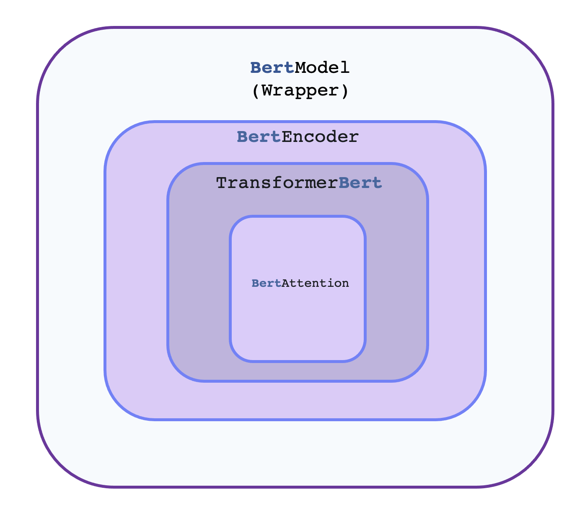

..
    Copyright 2020 TFT and The HuggingFace Team. All rights reserved.

    Licensed under the Apache License, Version 2.0 (the "License"); you may not use this file except in compliance with
    the License. You may obtain a copy of the License at

        http://www.apache.org/licenses/LICENSE-2.0

    Unless required by applicable law or agreed to in writing, software distributed under the License is distributed on
    an "AS IS" BASIS, WITHOUT WARRANTIES OR CONDITIONS OF ANY KIND, either express or implied. See the License for the
    specific language governing permissions and limitations under the License.

Philosophy
=======================================================================================================================

tf-transformers is designed primarily for industrial research. Rather than showing dummy tutorials to enhance the concept,
all the tutorials and design philosophy focus on making life of researchers east with standard tools. Our aim is to
help Deep Learning practitioners to pretrain , fine-tune and infer a models with maximum ease and knowledge.

- NLP researchers and educators seeking to use/study/extend large-scale transformers models
- hands-on practitioners who want to fine-tune those models and/or serve them in production
- engineers who just want to download a pretrained model and use it to solve a given NLP task.

The library was designed with two strong goals in mind:

- Be as easy and fast to use as possible:

    - We strongly limited the number of user-facing abstractions to learn, in fact, there are almost no abstractions,
      just three standard classes required to use each model: :doc:`configuration <main_classes/configuration>`,
      :doc:`models <main_classes/model>` .
    - All of these classes can be initialized in a simple and unified way from pretrained instances by using a common
      :obj:`from_pretrained()` instantiation method which will take care of downloading (if needed), caching and
      loading the related class instance and associated data (configurations' hyper-parameters, tokenizers' vocabulary,
      and models' weights) from a pretrained checkpoint provided on `Hugging Face Hub
      <https://huggingface.co/models>`__ or your own saved checkpoint.
    - On top of those three base classes, :class:`~tf_transformers.core.Trainer` to quickly train or fine-tune a given model.
    - As a consequence, this library is NOT a modular toolbox of building blocks for neural nets. If you want to
      extend/build-upon the library, just use regular Python/TensorFlow/Keras modules and inherit from the base
      classes of the library to reuse functionalities like model loading/saving.

- Provide state-of-the-art models with performances as close as possible to the original models:

    - We provide at least one example for each architecture which reproduces a result provided by the official authors
      of said architecture.
    - The code is written in pure Tensorflow 2.0 and most models supprt TFlite models also.

Main concepts
~~~~~~~~~~~~~~~~~~~~~~~~~~~~~~~~~~~~~~~~~~~~~~~~~~~~~~~~~~~~~~~~~~~~~~~~~~~~~~~~~~~~~~~~~~~~~~~~~~~~~~~~~~~~~~~~~~~~~~~

The library is built around three types of classes for each model:

- **Model classes** such as :class:`~tf_transformers.models.BertModel`is just a wrapper around
  :class:`~tf_transformers.models.BertEncoder`. The hierarchical flow remains the same for all or most models.
  The core architectural implementations is happening inside :class:`~tf_transformers.models.BertEncoder`.
  Every encoder has :class:`~tf_transformers.layers.transformers.TransformerBert` and
  corresponding attention implementations :class:`~tf_transformers.layers.transformers.MultiHeadAttention`.

- **Configuration classes** such as :class:`~tf_transformers.models.BertConfig`, which store all the parameters
  required to build a model. You don't always need to instantiate these yourself. In particular, if you are using a
  pretrained model without any modification, creating the model will automatically take care of instantiating the configuration
  (which is part of the model).

- **Tokenizer classes** such as :class:`~transformers.models.AlbertTokenizer`, which store the vocabulary for each model
  and provide methods for encoding/decoding strings in a list of token embeddings indices to be fed to a model.
  This is a faster implementation based on **tensorflow-text**.

- All encoders can be used as decoder with one argument :obj:`use_decoder=True`.

All these classes can be instantiated from pretrained instances and saved locally using two methods:

- :obj:`from_pretrained()` lets you instantiate a model/configuration/tokenizer from a pretrained version either
  provided by the library itself (the supported models are provided in the list :doc:`here <pretrained_models>`) or
  stored locally (or on a server) by the user,
- :obj:`save_checkpoint()` lets you save a model/ as tensorflow checkpoints.
- :obj:`save_transformers_serialized()` lets you save a model/ as tensorflow saved models.
